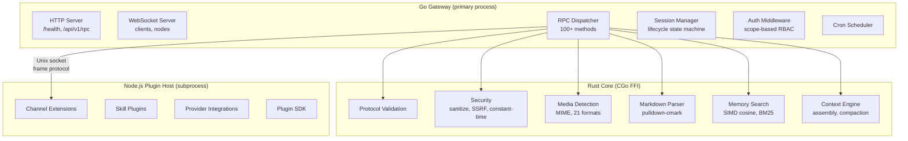
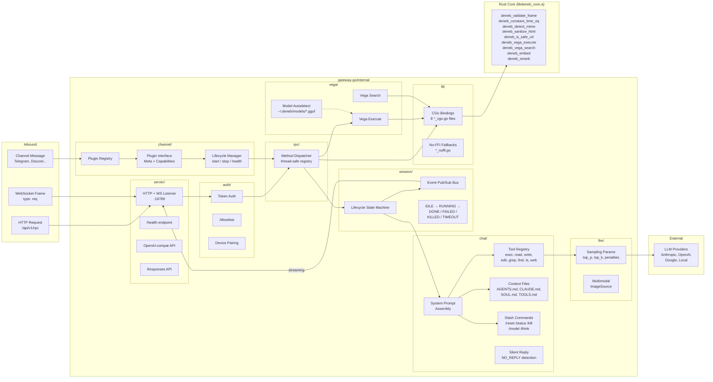
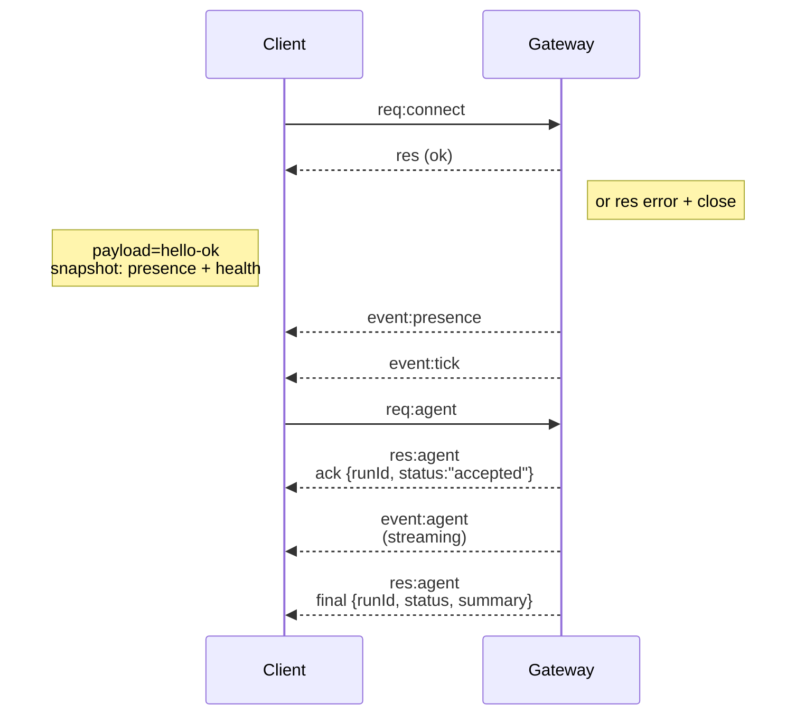

# Gateway architecture

Last updated: 2026-03-26

## Overview

Deneb runs as a multi-language gateway with three cooperating runtimes:

- **Go gateway** — the primary server process. Handles HTTP/WS, RPC dispatch, session state, auth, cron, and daemon management.
- **Rust core** (`core-rs`) — high-performance library linked into Go via CGo FFI. Handles protocol validation, security (constant-time compare, HTML sanitization, SSRF checks), media detection, markdown parsing, memory search (cosine similarity, BM25, hybrid merge), and context engine (assembly, compaction, sweep).
- **Node.js plugin host** — subprocess managed by the Go gateway over a Unix domain socket. Runs channel extensions, skill plugins, and provider integrations that use the TypeScript plugin SDK.

A single long-lived Gateway owns all messaging surfaces (Telegram via grammY, Discord, Slack, WhatsApp via Baileys, Signal, iMessage, WebChat, and extension channels).

<Tip>
Telegram is the primary production channel. Other channels exist in the
codebase but may not receive the same depth of optimization. See
[design philosophy](/concepts/design-philosophy) for details.
</Tip>

Control-plane clients (macOS app, CLI, web UI, automations) connect over **WebSocket** on the configured bind host (default `127.0.0.1:18789`).

**Nodes** (macOS/iOS/Android/headless) also connect over **WebSocket**, but declare `role: node` with explicit caps/commands.

One Gateway per host. The **canvas host** is served under `/__deneb__/canvas/` and `/__deneb__/a2ui/` on the same port.

## Runtime architecture



### IPC boundaries

| Path             | Transport                           | Use case                                                               |
| ---------------- | ----------------------------------- | ---------------------------------------------------------------------- |
| Go to Rust       | CGo FFI (in-process)                | Protocol validation, security, media, markdown, memory, context engine |
| Go to Node.js    | Unix domain socket + frame protocol | Channel extensions, skills, provider integrations                      |
| CLI to Gateway   | WebSocket                           | Commands, agent runs, status                                           |
| Protobuf schemas | Shared source of truth              | Cross-language type definitions (`proto/*.proto`)                      |

### Hardware-aware runtime

The gateway detects available hardware at startup and selects a **hardware profile** that tunes concurrency, memory, and acceleration:

| Profile              | Detection                       | Agent concurrency | Embedding batch | FFmpeg accel      |
| -------------------- | ------------------------------- | ----------------- | --------------- | ----------------- |
| **DGX Spark (GB10)** | NVIDIA Grace Blackwell GPU      | 10                | 8               | CUDA (h264_nvenc) |
| **Desktop GPU**      | Consumer NVIDIA (RTX 3090/4090) | 8                 | 6               | CUDA (h264_nvenc) |
| **CPU-only**         | No NVIDIA GPU detected          | 4                 | 2               | Software          |

GPU detection runs `nvidia-smi` at startup; override with `DENEB_GPU_ACCEL` env var (`dgx-spark`, `cuda`, `none`).

Each profile also tunes: V8 heap size, SQLite cache/mmap, UV threadpool, compute pool size (for worker threads), FFmpeg buffer/timeout, and image worker count.

## Full system overview

End-to-end view of every major component and how data flows from messaging channels through the gateway to LLM providers and back.

```mermaid
graph TB
    subgraph "Messaging Channels"
        TG["📱 Telegram<br>(primary channel)"]
        DC["Discord"]
        SL["Slack"]
        WA["WhatsApp"]
        SG["Signal"]
        IM["iMessage"]
        WC["WebChat"]
    end

    subgraph "Control Plane Clients"
        CLI["CLI (cli-rs)<br>Rust → WebSocket"]
        MAC["macOS App"]
        WEB["Web Admin UI"]
    end

    subgraph "Nodes"
        IOS["iOS Node"]
        AND["Android Node"]
        HL["Headless Node"]
    end

    subgraph DGX["NVIDIA DGX Spark"]
        subgraph GW["Go Gateway (gateway-go)"]
            HTTP["HTTP Server<br>/health, /api/v1/rpc,<br>OpenAI API, Responses API"]
            WSS["WebSocket Server"]
            RPC["RPC Dispatcher<br>130+ methods"]
            SESS["Session Manager<br>IDLE→RUNNING→DONE"]
            AUTH["Auth + Pairing"]
            CHAT["Chat Pipeline<br>system prompt, tools,<br>context files"]
            CRON["Cron Scheduler"]
            CHAN["Channel Registry<br>Plugin interface"]
        end

        subgraph FFI["Rust Core (CGo FFI)"]
            PROTO["Protocol Validation"]
            SEC["Security<br>sanitize, SSRF"]
            MED["Media Detection<br>21 formats"]
            MD["Markdown Parser"]
            MEM["Memory Search<br>SIMD cosine, BM25"]
            CTX["Context Engine<br>Aurora assembly"]
            CMP["Compaction<br>sweep engine"]
            PARSE["Parsing<br>URL, HTML→MD"]
        end

        subgraph VEGA["Vega Search Engine"]
            FTS["SQLite FTS5"]
            SEM["Semantic Search<br>(optional ML)"]
        end

        subgraph ML["ML Inference (deneb-ml)"]
            EMB["Embedder<br>GGUF models"]
            RR["Reranker"]
            CUDA["CUDA Acceleration"]
        end

        subgraph NH["Node.js Plugin Host"]
            CHANEXT["Channel Extensions"]
            SKILLRT["Skill Runtime"]
            PROVINT["Provider Integrations"]
        end

        SKILLS["Skills (17)<br>github, weather,<br>coding-agent, tmux,<br>himalaya, summarize..."]
        PROTO_SCHEMA["Proto Schemas<br>gateway.proto<br>channel.proto<br>session.proto"]
    end

    subgraph "LLM Providers"
        ANTH["Anthropic"]
        OAI["OpenAI"]
        GGL["Google"]
        LOCAL["Local GGUF<br>(on-device)"]
    end

    %% Channel → Gateway
    TG -->|"Bot API"| CHAN
    DC -->|"Bot API"| CHAN
    SL --> CHAN
    WA -->|"Baileys"| CHAN
    SG --> CHAN
    IM --> CHAN
    WC -->|"WS"| WSS

    %% Control plane
    CLI -->|"WebSocket"| WSS
    MAC -->|"WebSocket"| WSS
    WEB -->|"WebSocket"| WSS

    %% Nodes
    IOS -->|"WS role:node"| WSS
    AND -->|"WS role:node"| WSS
    HL -->|"WS role:node"| WSS

    %% Internal gateway flow
    WSS --> RPC
    HTTP --> RPC
    RPC --> AUTH
    RPC --> SESS
    SESS --> CHAT
    CHAT --> CRON
    CHAN --> RPC

    %% FFI calls
    RPC --> PROTO
    RPC --> SEC
    RPC --> MED
    CHAT --> MD
    CHAT --> MEM
    CHAT --> CTX
    CHAT --> CMP
    CHAT --> PARSE

    %% Vega + ML
    MEM --> FTS
    FTS --> SEM
    SEM --> EMB
    SEM --> RR
    EMB --> CUDA

    %% Plugin host
    RPC -->|"Unix socket"| CHANEXT
    SKILLRT --> SKILLS
    CHANEXT --> SKILLRT

    %% Proto schema codegen
    PROTO_SCHEMA -.->|"codegen"| PROTO
    PROTO_SCHEMA -.->|"codegen"| RPC

    %% LLM
    CHAT -->|"API calls"| ANTH
    CHAT -->|"API calls"| OAI
    CHAT -->|"API calls"| GGL
    CHAT -->|"local inference"| LOCAL
    LOCAL --> CUDA
```



## Gateway internal architecture

Detailed view of the Go gateway's internal package structure and request processing pipeline.



## Rust core crate architecture

The `core-rs/` workspace contains 4 crates with a layered feature-flag dependency chain.

```mermaid
graph TB
    subgraph "deneb-core (main crate)"
        direction TB
        LIBRS["lib.rs<br>30+ C FFI exports<br>(deneb_* functions)"]

        subgraph modules["Core Modules"]
            PROTO_M["protocol/<br>Frame validation<br>RequestFrame, ResponseFrame,<br>EventFrame, ErrorShape"]
            SEC_M["security/<br>constant_time_eq<br>sanitize_html<br>is_safe_url (SSRF)<br>is_valid_session_key"]
            MED_M["media/<br>Magic-byte MIME detection<br>21 formats, OOXML, ISOBMFF"]
            MEM_M["memory_search/<br>SIMD cosine similarity<br>BM25, FTS query builder<br>hybrid merge, MMR diversity"]
            MD_M["markdown/<br>pulldown-cmark parser<br>code spans, fences, tables"]
            CTX_M["context_engine/<br>Aurora assembly<br>DAG-aware token budgeting<br>handle-based FFI"]
            CMP_M["compaction/<br>Sweep state machine<br>chunk selection<br>threshold evaluation"]
            PARSE_M["parsing/<br>URL extraction<br>HTML-to-Markdown<br>base64, media tokens"]
        end

        LIBRS --> PROTO_M
        LIBRS --> SEC_M
        LIBRS --> MED_M
        LIBRS --> MEM_M
        LIBRS --> MD_M
        LIBRS --> CTX_M
        LIBRS --> CMP_M
        LIBRS --> PARSE_M
    end

    subgraph "deneb-vega"
        VEGA_CORE["SQLite FTS5<br>Search Engine"]
        VEGA_CMD["Commands<br>search, brief, changelog,<br>dashboard"]
        VEGA_DB["DB Layer<br>schema, importer,<br>parser, classifier"]
        VEGA_SEARCH["Search Pipeline<br>query analysis → FTS5 →<br>semantic → fusion/rerank"]
    end

    subgraph "deneb-ml"
        ML_EMB["Embedder<br>LocalEmbedder<br>GGUF text embeddings"]
        ML_RR["Reranker<br>LocalReranker<br>RankedDocument"]
        ML_MGR["Model Manager<br>TTL-based eviction<br>model pooling"]
        ML_CUDA["CUDA Backend<br>llama-cpp-2 bindings"]
    end

    subgraph "deneb-agent-runtime"
        ART_MODEL["Model Selection<br>provider normalization<br>catalog, thinking levels"]
        ART_SCOPE["Scope Resolution<br>agent registry<br>session key parsing"]
        ART_SUB["Subagent Lifecycle<br>Pending → Running → Terminal"]
        ART_USAGE["Usage Tracking<br>multi-provider normalization"]
    end

    subgraph "Feature Flags"
        F_DEFAULT["default"]
        F_VEGA["vega"]
        F_ML["ml"]
        F_CUDA["cuda"]
        F_VEGA_ML["vega-ml"]
        F_DGX["dgx (production)"]
    end

    %% Crate dependencies
    LIBRS -->|"optional"| VEGA_CORE
    VEGA_SEARCH -->|"optional (ml feature)"| ML_EMB
    VEGA_SEARCH -->|"optional (ml feature)"| ML_RR
    ML_EMB --> ML_MGR
    ML_RR --> ML_MGR
    ML_MGR -->|"cuda feature"| ML_CUDA

    %% Feature flag chain
    F_DEFAULT -.-> F_VEGA
    F_VEGA -.-> F_ML
    F_ML -.-> F_CUDA
    F_VEGA -.-> F_VEGA_ML
    F_VEGA_ML -.-> F_DGX

    subgraph "Build Targets"
        B_RUST["make rust<br>(minimal, no vega)"]
        B_VEGA["make rust-vega<br>(FTS only)"]
        B_DGX["make rust-dgx<br>(full: vega+ml+cuda)"]
    end

    F_DEFAULT -.-> B_RUST
    F_VEGA -.-> B_VEGA
    F_DGX -.-> B_DGX

    subgraph "Proto Schemas (proto/)"
        PGW["gateway.proto<br>ErrorCode, RequestFrame,<br>ResponseFrame, EventFrame"]
        PCH["channel.proto<br>ChannelCapabilities,<br>ChannelMeta"]
        PSS["session.proto<br>SessionRunStatus,<br>SessionKind"]
    end

    %% Proto → codegen
    PGW -->|"prost-build"| PROTO_M
    PCH -->|"prost-build"| PROTO_M
    PSS -->|"prost-build"| PROTO_M

    subgraph "Output Artifacts"
        STATIC["libdeneb_core.a<br>(staticlib → Go CGo)"]
        CDYLIB["libdeneb_core.so<br>(cdylib → Node.js napi)"]
        RLIB["rlib<br>(workspace internal)"]
    end

    LIBRS --> STATIC
    LIBRS --> CDYLIB
    LIBRS --> RLIB
```



## Components and flows

### Gateway (Go process)

- Primary server process; starts HTTP and WebSocket listeners.
- Dispatches RPC methods through a thread-safe registry (100+ built-in methods).
- Manages session lifecycle (state machine: IDLE, RUNNING, DONE, FAILED, KILLED, TIMEOUT).
- Runs auth middleware with scope-based authorization.
- Spawns and supervises the Node.js plugin host subprocess.
- Calls Rust core functions via CGo FFI for CPU-intensive operations.

### Plugin host (Node.js subprocess)

- Communicates with Go gateway over Unix domain socket using a frame-based protocol (RequestFrame/ResponseFrame).
- Runs channel extensions (Telegram, Discord, Slack, WhatsApp, etc.).
- Executes skill plugins and provider integrations via the TypeScript plugin SDK.
- Auto-reconnects with exponential backoff (1s to 30s max) if the connection drops.

### Clients (macOS app / CLI / web admin)

- One WS connection per client.
- Send requests (`health`, `status`, `send`, `agent`, `system-presence`).
- Subscribe to events (`tick`, `agent`, `presence`, `shutdown`).

### Nodes (macOS / iOS / Android / headless)

- Connect to the **same WS server** with `role: node`.
- Provide a device identity in `connect`; pairing is **device-based** (role `node`) and approval lives in the device pairing store.
- Expose commands like `canvas.*`, `camera.*`, `screen.record`, `location.get`.

Protocol details: [Gateway protocol](/gateway/protocol)

### WebChat

- Static UI that uses the Gateway WS API for chat history and sends.
- In remote setups, connects through the same SSH/Tailscale tunnel as other clients.

## Connection lifecycle (single client)



## Wire protocol (summary)

- Transport: WebSocket, text frames with JSON payloads.
- First frame **must** be `connect`.
- After handshake:
  - Requests: `{type:"req", id, method, params}` → `{type:"res", id, ok, payload|error}`
  - Events: `{type:"event", event, payload, seq?, stateVersion?}`
- If `DENEB_GATEWAY_TOKEN` (or `--token`) is set, `connect.params.auth.token`
  must match or the socket closes.
- Idempotency keys are required for side-effecting methods (`send`, `agent`) to
  safely retry; the server keeps a short-lived dedupe cache.
- Nodes must include `role: "node"` plus caps/commands/permissions in `connect`.

## Pairing + local trust

- All WS clients (operators + nodes) include a **device identity** on `connect`.
- New device IDs require pairing approval; the Gateway issues a **device token**
  for subsequent connects.
- **Local** connects (loopback or the gateway host's own tailnet address) can be
  auto-approved to keep same-host UX smooth.
- All connects must sign the `connect.challenge` nonce.
- Signature payload `v3` also binds `platform` + `deviceFamily`; the gateway
  pins paired metadata on reconnect and requires repair pairing for metadata
  changes.
- **Non-local** connects still require explicit approval.
- Gateway auth (`gateway.auth.*`) still applies to **all** connections, local or
  remote.

Details: [Gateway protocol](/gateway/protocol), [Pairing](/channels/pairing),
[Security](/gateway/security).

## Protocol typing and codegen

- **Protobuf schemas** (`proto/`) are the cross-language source of truth for frame types.
- Generated outputs: Go (`gateway-go/pkg/protocol/gen/`), Rust (prost, `OUT_DIR`), TypeScript (`src/protocol/generated/`).
- TypeBox schemas define the WebSocket protocol surface.
- JSON Schema is generated from TypeBox schemas.
- Swift models are generated from the JSON Schema.
- Generation: `make proto` (parallel Go + Rust + TS).

## Remote access

- Preferred: Tailscale or VPN.
- Alternative: SSH tunnel

  ```bash
  ssh -N -L 18789:127.0.0.1:18789 user@gateway-host
  ```

- The same handshake + auth token apply over the tunnel.
- TLS + optional pinning can be enabled for WS in remote setups.

## Operations snapshot

- Start: `deneb gateway` (foreground, logs to stdout).
- Health: `health` over WS (also included in `hello-ok`), or `GET /health` over HTTP.
- Supervision: launchd/systemd for auto-restart.

## Invariants

- Exactly one Gateway per host.
- Go gateway is the primary process; Node.js plugin host is a managed subprocess.
- Rust core functions are called in-process via CGo FFI (zero IPC overhead).
- Handshake is mandatory; any non-JSON or non-connect first frame is a hard close.
- Events are not replayed; clients must refresh on gaps.
