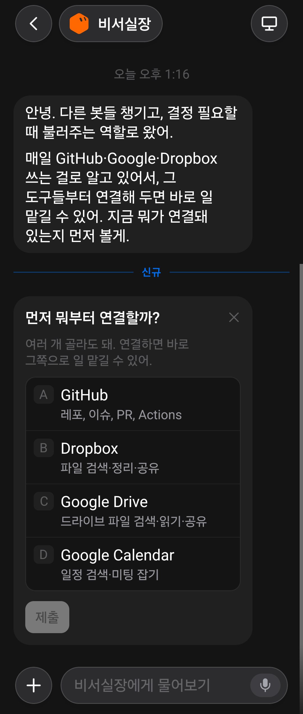

# 장인 참조 (Design references)

운영자가 "이건 참고해라"라고 건넨 외부 화면들. **북극성은 아니다** — ADR 0007
("메뉴가 아니라 결과")이 판정 기준이고, 여기 것들은 그 기준 아래에서 *무엇을
빌릴지 / 무엇은 빌리면 안 되는지*를 적은 카드다. 새 참조를 넣을 때는 같은 틀로.

## 2026-09-06 · Grok "비서실장" 봇 첫 화면

운영자 지시: "grok bot. 데네브 ui 에 참고" — 다크 챗 UI, 페르소나 이름 필,
첫 인사 말풍선, 파란 `신규` 구분선, 그 아래 **다중선택 질문 카드**(제목·도움말·
A~D 레터 배지 옵션·옵션별 한 줄 설명·비활성 `제출`·닫기 X), 하단 컴포저
(`+` · "비서실장에게 물어보기" · 마이크).

### 처리 결과 (2026-09-06, 운영자 "플레이스홀더 빼고 해봐")

| 항목 | 결과 |
|---|---|
| 옵션별 한 줄 설명 + A/B/C 레터 배지 | ✅ #5046 — `<chips layout="list" lettered>` + `<chip description>`; 첫 컷의 "체크박스+배지 이중 컨트롤"은 운영자 지적("촌스럽다")으로 DenebGroup idiom(그룹 서피스·배지=컨트롤)으로 재작업 |
| 선택 전 비활성 제출 | ✅ #5046 — `collect` 대상에 빈 `required`가 있으면 버튼이 회색(옛 "누르면 경고" 계약을 뒤집음) |
| 카드 닫기 X | ✅ #5048 — `<card dismissible>`, 세션 로컬 접기("넘긴 카드 · 다시 보기") |
| `신규` 구분선 | ✅ #5049 — 대화별 마지막 연 시각(기기 저장) 기준, 전부 새것이면 생략 |
| 플레이스홀더 "비서실장에게 물어보기" | ⏸ 운영자가 제외 |
| 첫 인사 말투 | — 프롬프트 사안, 미착수 |

### 빌릴 것 (deneb-ui 격차 = 실제 작업 후보 — 당시 판독)

| 참조의 요소 | Deneb 현재 | 격차 |
|---|---|---|
| 옵션별 **한 줄 설명** ("GitHub — 레포, 이슈, PR, Actions") | `radio-group`/`select`/`chips` 옵션이 **라벨 문자열만** (`options: List<String>`, `ChipItem{value,label}`) | 그래머에 `description` 속성 없음 → 3구현 + 테스트 벡터 |
| **A/B/C/D 레터 배지** | 없음 | 음성 답변("B로 해줘")·빠른 선택의 손잡이. 렌더러만으로 가능(`lettered` 속성) |
| **선택 전 비활성 `제출`** | `required`가 **누를 때** 막고 표시 (설계된 동작 — `DenebUiInputs.kt` 주석) | 시각만 다름(회색 vs 눌러서 경고). 바꾸려면 결정 필요 |
| 카드 **닫기 X** | 없음 | 인터랙티브 카드를 "안 고르고 넘김"으로 접는 손잡이 |
| 파란 **`신규` 구분선** | 채팅 목록에 읽지 않음 구분선 없음 | 네이티브 전용 소작업 |
| 컴포저 플레이스홀더 "**비서실장에게 물어보기**" | "메시지를 입력하세요" | 문자열 2개(ko/en). 페르소나 호칭 — 한 목소리 원리와 맞음 |
| 첫 인사의 **말투** ("~역할로 왔어", "먼저 볼게") | — | 프롬프트 문제. 짧은 반말, 자기 역할 선언, 다음 행동 예고 |

### 빌리면 안 되는 것

- **"먼저 뭐부터 연결할까?" 자체** — 서비스 메뉴로 시작하는 온보딩. ADR 0007이
  정확히 거부한 패턴(슈퍼앱 = 서비스 선택). Deneb은 이미 연결된 것을 **읽은 결과**로
  가져와야 하고("지금 뭐가 연결돼 있는지 먼저 볼게"는 오히려 맞는 말), 고르게
  하는 건 그 다음이다.
- 카드 하나에 선택지 4개 — 우리 인터랙티브 카드는 **결정 요청**(승인/기각·둘 중
  하나)이 기본이다(heartbeat/proactive 계약). 다중선택은 도구 연결 같은 설정성
  질문에만.

## 2026-09-20 · Windows Phone 7 "Metro" · Zune HD

운영자 지시: "Typo 중심의 윈도폰이나 zune hd ui 같은 디자인을 데네브 안드로이드
앱에 더 적용". 이미지 없이 이름으로 건넨 참조 — 두 UI의 공통 문법은 **활자가 곧
인터페이스**다: 큰 Light 제목, 피벗 헤더(현재 섹션은 흰색·이웃 섹션은 회색으로
가장자리에 걸쳐 흘림), 크롬 없음(박스·밑줄·구분선·장식 아이콘 없음), 위계는
크기·웨이트·밝기로만, 전부 왼쪽 정렬, 검정 바탕에 액센트 하나.

### 처리 결과

| 항목 | 결과 |
|---|---|
| 피벗 헤더(밝기로 상태, 크롬 없음) | ✅ 이미 피드\|결재\|로그가 쓰던 문법을 `DenebPivotRow`로 올리고 스킬(스킬 목록\|Propus 로그)·관찰(1일\|7일)·플릿(노드\|모델\|작업) 뷰 전환기에 적용. 파란 텍스트 탭·알약 탭이 사라져 뷰 전환 문법이 하나가 됐다 |
| 넘치는 헤더가 가장자리로 흘림(bleed) | ✅ `DenebPivotRow`는 수평 스크롤 — 줄바꿈·축소 대신 잘려 나간다. 골든 `pivot.png` |
| 상태를 그림이 아니라 문장으로 | ✅ `DenebEmpty`/`DenebError` — 아이콘 제거, `subject` 크기 문장 왼쪽 정렬, 이유는 아래 흐리게, 행동은 텍스트 버튼. 골든 `states.png` |
| 크롬 없음 — 박스·알약·필 탭 | ✅ 2차(운영자 "못생긴 알약모양도 바꿔주지"): Material `SegmentedButton`→`DenebSegment`(활자+2dp 밑줄), `SuggestionChip`→`DenebChip`, 하단바 인디케이터 필 제거, 카드 `<tabs>` 필→`DenebSegment`, 스타디움 배지 5곳→`DenebBadge`. 골든 `controls.png`·`cron_edit*.png`·`files_search_mode_*.png`·`bottombar_*.png` |

### 빌릴 것 (남은 후보)

| 참조의 요소 | Deneb 현재 | 격차 |
|---|---|---|
| 목록에 구분선 없음(간격이 구조) | 콘텐츠 목록은 `DenebRow` 하airline | 전 화면 골든이 바뀌는 크기라 별도 판단 |
| 자가개선 코딩 탭의 상태 필터(카운트 달린 파란 텍스트) | 필터는 목록을 좁히지 뷰를 바꾸지 않음 | 피벗으로 통일할지 운영자 판단 |

### 빌리면 안 되는 것

- **페이지 제목 확대**(WP7 65px급) — ADR 0007 원리 1: 화면에서 가장 큰 활자는
  산출물이어야지 비계(제목)가 아니다. `viewTitle` 28sp/Light 유지.
- **타일 홈 화면** — 북극성 "메뉴가 아니라 결과"가 정확히 거부한 것(타일 = 서비스
  메뉴). 하단 5탭도 ADR 0007이 "뒤집지 않는다"로 못박았다.
- **액센트 타일 색·테마 색 선택** — 단일 액센트(ADR 0008 job 1)·OLED 단일 테마.
- **턴스타일·페이지 넘김 모션** — 모션은 실기기 녹화 후 별도 ADR(미결). 그때까지
  `DenebMotion` 토큰만.
- **소문자 제목 관용구** — 한글엔 대소문자가 없다(원리 4). 라틴 트릭을 상속하지
  않는다.
