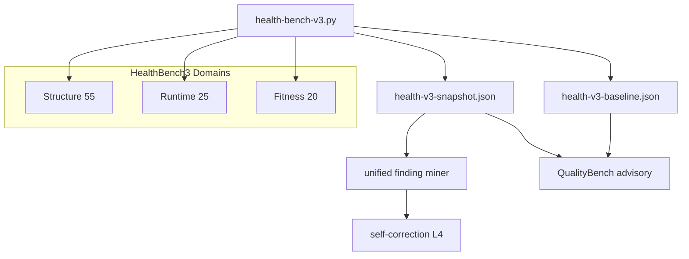

# Health Bench 3.0

> Status: **design locked** (2026-07-15). Implementation follows in slices;
> this note is the source of truth for rubric, composite math, calibration,
> and RSI wiring until `docs/agent-rules/codebase-health-v3.md` is promoted.

## North star

**100 = the codebase, production runtime, and RSI feedback loop are healthy
enough that an agent can safely self-improve for a year without human
structural rescue.**

Current main under Health Bench 2.2 scores **88.2** structural overall. That
ceiling is a calibration failure relative to the north star, not proof the
tree is nearly done. Health Bench 3.0 remeasures from absolute bars so the
**first accepted baseline lands in 45–55**. v2 scores are never arithmetically
converted.

Three domains form one product. Domains **do not compensate**: a gain in one
must not hide a meaningful regression in another.



| Domain | Weight | Role |
|---|---:|---|
| Structure | 0.55 | Maintainability / change risk (v2 successor) |
| Runtime | 0.25 | Production journal health (`runtime_health` absorbed) |
| Fitness | 0.20 | RSI operator-visible utility (new) |

### Composite

\[
\mathrm{overall} = \mathrm{round}\Bigl(\exp\bigl(\sum_d w_d \ln s_d\bigr)\Bigr)
\]

Geometric mean of domain scores with fixed weights. Any **required** domain
evidence that is `unavailable` / `scored=false` fails the run as a tooling
error — missing evidence is never treated as 100 (v2 fail-closed).

Inside each domain: weighted arithmetic mean of pillars/metrics + per-pillar
ratchet (same spirit as v2).

### Check failures

`--check` fails when any of:

- overall drops beyond tolerance (default 0.3)
- any **ratcheted** domain or pillar drops beyond tolerance (pillar 1.0)
- new `high` / `critical` finding appears, or severity escalates high→critical
- schema, rubric, profile, or pillar/domain set mismatches baseline

**Initial CI policy:** ratchet Structure + cached Runtime. Fitness is scored
and reported but **advisory-only** until label fidelity is proven (RSI P5-5);
then promote into the ratchet with an explicit `--migrate-rubric`.

---

## Why ~50 now (calibration principles)

| v2 phenomenon | 3.0 response |
|---|---|
| contract / delivery / runtime-safety ≈ 100 | Raise absolute bars from “exists / passes” to “proven, traced, tailed”; score signals that were diagnostic-only |
| AI pillars Go-only yet high | Unmeasured product lanes **deduct by impact weight** (not confidence-only) |
| locality 55 / cohesion 56 but overall 88 | Raise their weight (Change blast) + geometric mean across domains |
| mutation / deadcode unscored | Score in `deep`; `fast` must not invent 100 |
| Meta sees accepted baseline only | Fitness: live snapshot − baseline delta + 28d trend |

Anti-gaming invariants (preserved from v2):

- LOC, file count, raw test volume are diagnostic (`scored: false`) only
- `tail_score` so tiny clean units cannot dilute hotspots
- Test ratios fold semantic shapes, not raw case counts
- Doc length / presence alone scores nothing; links must resolve
- Shallow git history fail-closed
- One-way baseline; never hand-edit floors to green a check
- Product-lane impact ≠ LOC share

---

## Domain A — Structure (weight 0.55)

Successor to `scripts/audit/health_v2/`. Eleven v2 pillars compress to **eight**.
Internal weights sum to 100.

| Pillar | W | Question | Calibration lever vs v2 |
|---|---:|---|---|
| Change blast | 20 | How many responsibilities/components does one feature touch? | Merge locality + cohesion; tighten cross-component / volatile-hub tails so today’s ~55/56 band rescales to low-30s |
| Boundary & contracts | 14 | Are deps/ownership/typed contracts one-way? | Keep fan-out/SCC; **score** dependency bag + raw API blast (diagnostic in v2) |
| AI maintainability | 16 | Can an agent find entrypoints, invariants, and verify commands on every product lane? | Lane weights: Go 45 · Kotlin 25 · TS 15 · Python 10 (shell/rust N/A for AI guides). Unmeasured lane → that share contributes 0, not skipped |
| Complexity & static safety | 10 | Are worst paths and error chains safe? | Complexity tail + score ignored-result / lost-chain style signals (conservative AST/proxy) |
| Test truth | 16 | Do independent risk behaviors have real oracles? | Keep obligation + shape locality; **`deep` adds mutation kill-rate** |
| Test craft | 8 | Are tests intentional, isolated, discoverable? | v2 maintainability + shape uniqueness |
| Delivery proof | 10 | Do high-impact lanes actually gate merges? | Beyond workflow existence: required-check + path-trigger coherence; `deep` adds recent execution evidence |
| Dead surface | 6 | Is dead export / unreferenced surface accumulating? | `deep`: deadcode miner evidence; `fast`: inventory proxy only |

### Profiles

| | `fast` (PR) | `deep` (nightly / manual) |
|---|---|---|
| Network / live Deneb | No | No for structure; mutation/deadcode local |
| Determinism | Same revision → same JSON + finding IDs | Pinned tool versions |
| Mutation / deadcode | Not in score | In score when tools present; else `unavailable` |
| Delivery | Static proof surface | + recent execution / race where pinned |

---

## Domain B — Runtime (weight 0.25)

Absorbs `scripts/audit/runtime_health.py`. Same six dimensions, **renormalized
to domain-internal weights** and emitted under the Health Bench 3 finding
contract (What / Why / Where / How / Verify).

| Dimension | W (internal) | Live signal (2026-07-15, ~7d window) |
|---|---:|---|
| stability | 18 | 100.0 (0 crash) |
| error-rate | 16 | 83.2 (~0.13 err/run) |
| llm-serving | 16 | 100.0 (~0.01 hard/run) |
| turn-reliability | 16 | 79.4 (~2.9% timeout) |
| tool-reliability | 14 | 93.9 (~1.2% tool err) |
| latency | 20 | 54.9 (p95 ~141s) |
| **Live composite (v1 bars)** | | **~84.2** |

World-class soft/hard bars are **tightened** in 3.0 so the same live window
projects near the mid-50s (see worksheet). Latency and error-rate are the
primary screws; stability stays near-ceiling only with zero crashes.

| Profile | Source |
|---|---|
| `fast` (CI) | `~/.deneb/data/health-v3-runtime-cache.json` (live cache, written by deep/`--refresh-runtime-cache` on the gateway host; checked-in `scripts/audit/health-v3-runtime-cache.json` is a seed fallback only — 2026-07-27 fix: writing the tracked copy got reverted for auto-deploy cleanliness, so it was permanently stale). Stale TTL / missing cache → domain measurement failure |
| `deep` / live | journald via existing collector |

---

## Domain C — Fitness (weight 0.20)

Operator- and loop-visible utility. **Deterministic numbers only** — no LLM
judge. Grounds RSI P5-5 without becoming the skill acceptor.

| Metric | W | Definition |
|---|---:|---|
| Live delta | 30 | `snapshot.overall − baseline.overall` and weakest-pillar deltas. Snapshot is written by external `health-bench-v3` — gateway never runs Python in-process (genesis leaf boundary) |
| Trend 28d | 25 | Slope / non-regression over snapshot time series |
| Finding→land fidelity | 25 | `health-finding` propose → dispatch → land rate and revert (tracker / Action ledger) |
| Feed-card utility | 20 | 7d adopt / reject / revert aggregate (existing ledger) |

Until fidelity is proven: scored + advisory to meta producer; **not** in CI
ratchet.

---

## Score worksheet (design-time projection)

Inputs frozen for this design note:

- v2 baseline `scripts/audit/health-v2-baseline.json`: overall **88.2**, weakest
  change-locality **55.0**, responsibility-cohesion **56.6**
- Live runtime-health (2026-07-15): composite **~84.2** (latency 54.9 dominant drag)
- Fitness: no v3 time series yet — proxies from idle L4 / feed-card sparsity

### Structure pillar projections (target domain ≈ 50)

| Pillar | W | Projected | Rationale |
|---|---:|---:|---|
| Change blast | 20 | 32 | Rescale + tighter bar on today’s 55/56 |
| Boundary & contracts | 14 | 62 | Score bag/blast; raise SCC soft/hard |
| AI maintainability | 16 | 38 | ~Go-quality × 0.45 impact; K/TS/Py unpaid |
| Complexity & static safety | 10 | 62 | Score prior diagnostic tails |
| Test truth | 16 | 65 | Stricter oracle locality; no mutation in fast |
| Test craft | 8 | 75 | Mild tighten |
| Delivery proof | 10 | 42 | Existence → proof demotion |
| Dead surface | 6 | 40 | Inventory proxy; deep later |
| **Structure domain** | 100 | **50.4** | |

### Runtime projections under tightened bars (target domain ≈ 55–60)

| Dimension | W | Live (old bars) | Projected (3.0 bars) |
|---|---:|---:|---:|
| stability | 18 | 100 | 90 |
| error-rate | 16 | 83 | 52 |
| llm-serving | 16 | 100 | 75 |
| turn-reliability | 16 | 79 | 48 |
| tool-reliability | 14 | 94 | 62 |
| latency | 20 | 55 | 28 |
| **Runtime domain** | | **~84.2** | **58.5** |

If Runtime bars were left at today’s soft/hard, overall would sit ~55+ and
defeat the “honest 50” band — **tightening Runtime is mandatory** for the
calibration contract.

### Fitness proxies (target domain ≈ 43–45)

| Metric | W | Proxy |
|---|---:|---:|
| Live delta | 30 | 40 (flat / unknown snapshot) |
| Trend 28d | 25 | 50 (neutral until series exists) |
| Finding→land | 25 | 42 (health-finding graduated; fidelity still maturing) |
| Feed-card | 20 | 40 (sparse operator verdicts) |
| **Fitness domain** | | **43.0** |

### Composite check

\[
\exp(0.55\ln 50.4 + 0.25\ln 58.5 + 0.20\ln 43.0) \approx \mathbf{50.7}
\]

Sensitivity (same weights): low ≈ 47 / mid ≈ 51 / high ≈ 54 — inside the
**45–55** first-baseline expect-band. First `--write-baseline` must use
`--expect-band 45:55`. If the real scorer lands outside, **fix thresholds /
evidence**, do not stretch the band to fit.

Worked arithmetic (domain internals):

```text
Structure = (20*32 + 14*62 + 16*38 + 10*62 + 16*65 + 8*75 + 10*42 + 6*40) / 100
          = 5040 / 100 = 50.4

Runtime   = (18*90 + 16*52 + 16*75 + 16*48 + 14*62 + 20*28) / 100
          = 5852 / 100 = 58.5

Fitness   = (30*40 + 25*50 + 25*42 + 20*40) / 100
          = 4300 / 100 = 43.0

overall   = exp(0.55*ln(50.4) + 0.25*ln(58.5) + 0.20*ln(43.0)) ≈ 50.7
```

---

## Product surface

| Item | Decision |
|---|---|
| CLI | `scripts/audit/health-bench-v3.py` |
| Package | `scripts/audit/health_v3/` — `structure/` (port+harden v2), `runtime/` (wrap `runtime_health`), `fitness/` (new) |
| Schema | `SCHEMA_VERSION = 3`, `RUBRIC_VERSION = "3.0.0"` |
| Baseline | `scripts/audit/health-v3-baseline.json` |
| Runtime cache | `~/.deneb/data/health-v3-runtime-cache.json` (live); `scripts/audit/health-v3-runtime-cache.json` (checked-in seed fallback) |
| Live snapshot | `scripts/audit/health-v3-snapshot.json` (external writer; meta + Fitness read) |
| Make | `health-v3`, `health-v3-check`, `health-v3-deep`, `health-v3-test`, `health-v3-baseline` |
| Coexistence | v1 `codebase-health.py`, v2, and standalone `runtime-health.py` stay until CI switches |
| CI cutover | After scorer + anti-gaming fixtures stable: `health-v2-check` → `health-v3-check` |
| Miner | Single miner consumes v3 JSON findings (retire dual v2+runtime paths) |
| Meta | `gateway-go/internal/runtime/server/meta_quality_bench.go` reads baseline + snapshot delta (advisory); still no in-process Python |

### Finding contract

Every low metric that implies action emits a finding with stable id
(`rule` + path/symbol/edge), What / Why / Where / How / Verify. Display order
follows `change frequency × blast radius × test gap` (and runtime rate ×
user impact for Runtime). Shared remediation+verify → one intervention.

### Migration

```bash
python3 scripts/audit/health-bench-v3.py \
  --write-baseline scripts/audit/health-v3-baseline.json \
  --expect-band 45:55
```

Rubric changes: `--migrate-rubric` remeasure from prior baseline file as
provenance source — **never** map 88.2 → 50 by formula.

---

## RSI wiring

| Hook | Behavior |
|---|---|
| P5-3 proactive L4 | Unified miner files `health-finding:<id>` from Structure (+ Runtime when cached/live) |
| P5-5 advisory | Meta producer sees overall, weakest pillars, live delta, runtime weakest dims, feed-card — **no gate reads Fitness until promoted** |
| Leaf boundary | Snapshot/cache written by scripts or timers outside `gateway-go`; genesis stays a leaf |

Follow-ups explicitly out of 3.0 composite (adjacent):

- quality-test / recall-bench as separate product-quality axes (partially
  grounded via feed-card)
- P3 verifier charter enforcement (`IsCharterCase` production callers)

---

## Implementation slices (after this design)

1. `health_v3` skeleton + Structure rescoring + anti-gaming fixtures + expect-band
2. Runtime cache contract + tightened bars + Fitness snapshot/trend readers
3. Unified CLI, schemas, migration helpers
4. Miner + meta delta wiring; then CI ratchet cutover

---

## Agent rule promotion outline

When implementation starts, promote this design into
`docs/agent-rules/codebase-health-v3.md` with approximately:

```yaml
---
description: "Health Bench 3.0 점수·finding·baseline·도메인 ratchet 규약"
globs:
  - "scripts/audit/health-bench-v3.py"
  - "scripts/audit/health_v3/**"
  - "scripts/audit/health-v3-*.json"
---
```

### Proposed sections (mirror v2 rule shape)

1. **평가 원칙** — north star, geometric composite, fail-closed, score vs readiness
2. **Rubric 3.0.0** — three domains, Structure 8 pillars, Runtime 6 dims, Fitness 4 metrics + weights
3. **측정 신뢰도** — fast vs deep, runtime cache TTL, multi-lane AI unpaid share, shallow history
4. **Finding 계약** — What/Why/Where/How/Verify, intervention grouping
5. **Baseline과 ratchet** — tolerances, one-way update, Fitness advisory→gate ladder, `--expect-band 45:55`
6. **변경 시 검증** — `make health-v3-test` anti-gaming list (byte-stable JSON, no LOC gaming, no compensation across domains)
7. **명령**

```bash
make health-v3
make health-v3-check
make health-v3-deep
make health-v3-test
python3 scripts/audit/health-bench-v3.py --update-baseline
```

Until that rule file exists, agents editing health bench code should read
**this research note** plus `docs/agent-rules/codebase-health-v2.md` for
ratchet/anti-gaming precedent.

Also index in root `CLAUDE.md` rules table when the agent-rule file lands:

`| codebase-health-v3.md | Health Bench 3.0 점수·finding·baseline 변경 |`

---

## Non-goals

- Replacing genesis deterministic accept/reject gates with health scores
- Folding quality-test or recall-bench into the 3.0 composite in v1 of the scorer
- Running the Python bench inside the gateway process
- Comparing or converting v1/v2 composites into v3 numbers
- Using LLM judges inside Fitness metrics

## Invariants

- Deterministic gates; LLM produces only
- Required evidence missing ≠ healthy
- Baseline one-way; no silent floor edits
- Genesis leaf: external snapshot/cache only
- Cross-rubric scores incomparable; migrate by remeasure
