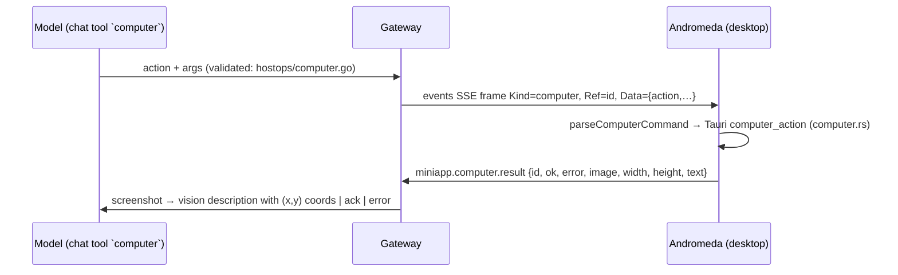

# Computer use (Andromeda)

The `computer` chat tool lets Deneb look at the user's screen and drive the
mouse/keyboard of the machine running **Andromeda** (the Tauri desktop
workstation). It is the host-OS sibling of `workstation` (which only arranges
Andromeda's own panes) and of `browser` (which drives Chrome through Page Agent).

## Loop

- **Transport**: the same events SSE as `workstation`/`phone_action`, gated on a
  connected desktop subscriber (`X-Deneb-Client-Kind: desktop`). Every command
  has a result round trip (unlike `workstation`): the tool waits up to 30 s
  (`computerResultWait`) for `miniapp.computer.result`, correlated by the frame's
  `Ref`. Timeout → clear Korean error (app hidden / setting off).
- **Screenshots are text to the model**: tool results are strings, so the
  gateway reads the PNG with the vision chain (`pilot.DescribeImage`: main
  model → dedicated vision role, OCR as last resort) using a UI-inventory
  prompt that lists actionable elements with image-pixel coordinates. The raw
  PNG is kept at `<state>/cache/computer/last.png` for the operator.
- **Coordinate frame**: the model always speaks in the pixel space of the
  *last screenshot* (possibly a zoomed region, possibly downscaled to 1600 px
  wide). The Rust side remembers that frame (origin + logical-px-per-image-px)
  and maps every click/move/drag through it, so HiDPI and downscale never leak
  into the model's reasoning.

## Grammar

Gateway `hostops/computer.go` ↔ desktop `andromeda/src/computer.ts` ↔ `andromeda/src-tauri/src/computer.rs`.

| action | args | notes |
|---|---|---|
| `screenshot` | optional `x,y,width,height` (zoom region in last-frame coords) | returns the vision description |
| `click` | `x,y[,button=left/right/middle]` | |
| `double_click` / `right_click` / `move` | `x,y` | |
| `drag` | `x,y,to_x,to_y` | press → midpoint → release |
| `scroll` | `x,y[,scroll=up/down/left/right][,amount 1-50]` | |
| `type` | `text` (max 4000 runes) | enigo `text()`; Korean works on X11/macOS/Windows |
| `key` | `key`: `Return`, `Tab`, `Escape`, `ctrl+c`, `cmd+shift+t`, `alt+Tab`, single char | modifiers: ctrl/alt/shift/cmd(meta) |
| `wait` | `wait_ms` 1-10000 | |
| `cursor` | none | pointer position in last-frame coords |

Both ends validate; the desktop drops malformed frames but still reports
`ok=false` so the tool fails fast instead of timing out.

## Safety posture

- **Off by default.** Andromeda 설정 › 일반 › "데네브의 컴퓨터 조종 허용"
  (`localStorage andromeda.computerUse`). While off, frames are answered with
  `ok=false` plus a Korean reason; nothing is ever executed silently.
- **Visible.** Every executed action is a "컴퓨터 조종" nudge in the proactive
  panel (same pattern as 화면 조정).
- **Deferred tool**: fetched via `fetch_tools` on demand; the description tells
  the model to use it only on explicit request, to confirm before irreversible
  clicks (삭제·결제·전송), never to type passwords/OTPs, and to stop after ~10
  steps without progress.
- Usage tally: `<state>/cache/computer_usage.json` (same writer as the
  workstation ledger).

## Platform notes

- **Screenshot**: macOS `screencapture -x -D 1` (needs Screen Recording
  permission; macOS prompts once); Linux X11 via `x11rb` GetImage, Wayland
  via whichever of `grim` / `gnome-screenshot` / `spectacle` / `import` / `scrot`
  is installed; Windows via PowerShell `CopyFromScreen`. No pipewire/portal
  build dependency.
- **Input**: `enigo` (default `x11rb` backend on Linux, so X11/XWayland windows;
  native on macOS/Windows). macOS needs Accessibility permission for Andromeda.
- Web (Vite) build: no executor; answers "데스크톱 앱 필요".

## Verifying without a real desktop

<Steps>
  <Step title="Start the dev gateway">
    `scripts/dev/live-test.sh restart` (port from `smoke`).
  </Step>
  <Step title="Subscribe a fake desktop">
    SSE `GET /api/v1/miniapp/events` with `X-Deneb-Client-Kind: desktop`; on a
    `computer` frame POST `miniapp.computer.result`
    `{id: frame.ref, ok: true, image: <base64 png>, width, height}`.
  </Step>
  <Step title="Drive a turn">
    `scripts/dev/live-test.sh chat "computer 도구로 스크린샷 찍고 화면 요약해줘"`:
    the model fetches the tool, the frame round-trips, the vision description
    comes back as the tool result. Check `live-test.sh logs-grep computer`.
  </Step>
</Steps>

Unit coverage: `gateway-go/internal/pipeline/chat/tools/hostops/computer_test.go` (grammar),
`gateway-go/internal/runtime/server/server_computer_test.go` (awaiter, gate, round trip, cancel),
`andromeda/src/computer.test.ts` and `andromeda/src/components/ProactivePanel.intercept.test.tsx`
(parse, gate, report, intercept), `andromeda/src-tauri/src/computer.rs` tests (frame math, key combos).
